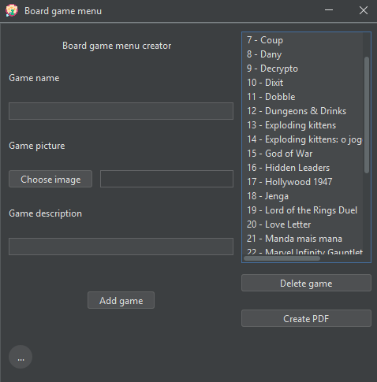
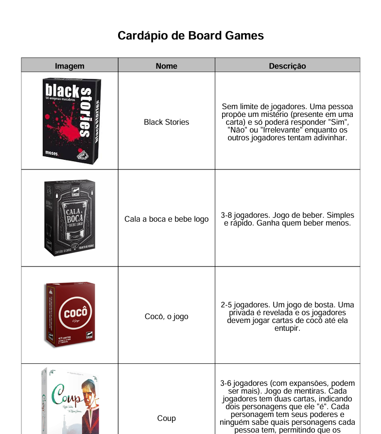
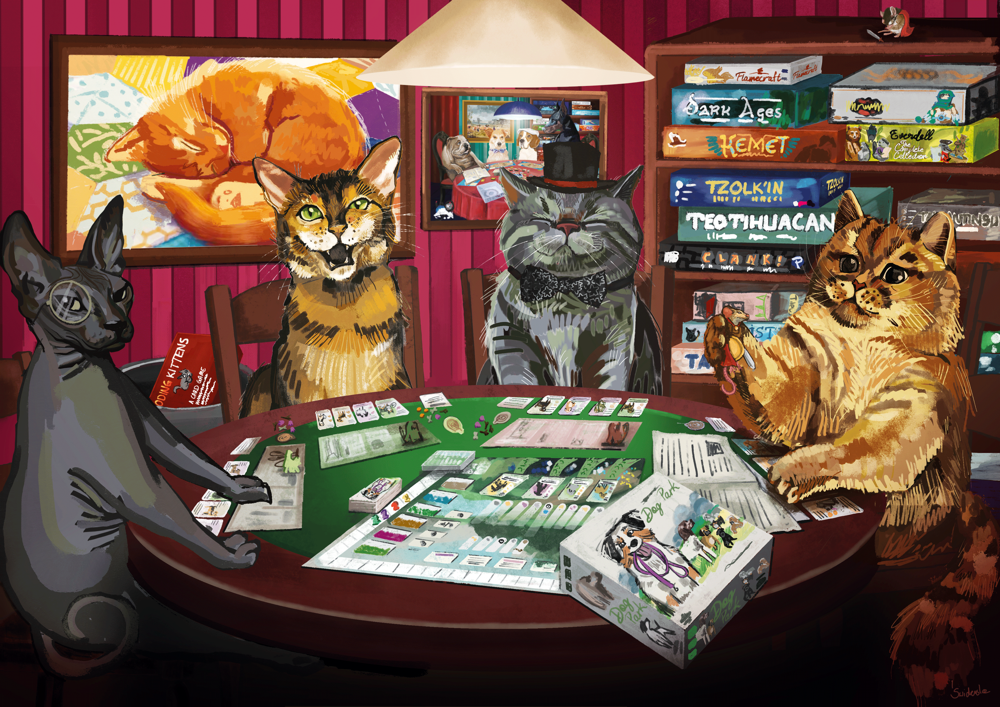

# BoardGameMenu

This is a Java application that saves information about board games (name, photo and description) and then generates a PDF with it: creating a menu of board games!

## The idea

Sometimes I host game nights and it always bugged me that I have to get all the games to the table so that we can decide what to play, and then get them back to their places.

So I got an idea: make it so that I only have to send everybody a list of what games are available. And that's how this study project was born: a way to make choosing what games to play easier!

## The application

The application has a simple UI:
- on the left side, you add games, filling their information;
- on the right side, you manage your saved games and generate the PDF with them.

    

 

The created file will look like the image below:

    

 

Currently, the PDF's columns are written in portuguese, but I might change that, in the future (maybe changing depending on the OS language or some other similar feature).

## Thanks

I could only think of building this because of my family and friends who give me the best game nights regularly. So thank you for making my life more fun!

And thank you, for reading!

    

(Image by
[Justyna Świderska](https://www.artstation.com/justyna56))
